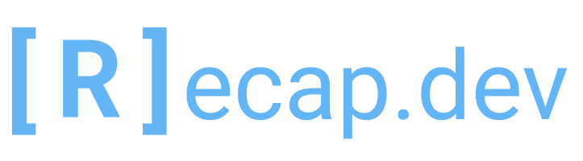

<p align="center">
  <a href="https://recap.dev" target="_blank" align="center">
    
  </a>
  <br />
</p>

[](https://www.npmjs.com/package/sails-hook-recap-dev) [](https://github.com/infinite-cat/sails-hook-recap-dev/blob/master/LICENSE) [](https://hub.docker.com/repository/docker/recapdev/server)

[Website](https://recap.dev) | [Documentation](https://recap.dev/docs/) | [Demo](https://demo.recap.dev/) | [Report a Bug](https://github.com/infinite-cat/recap.dev-server/issues/new)


recap.dev is an open-source cloud observability and tracing solution for modern JavaScript backends. Our goal is to make it easier for everyone to find sources of errors, find bottlenecks, and improve overall developer quality of life.

* **Detailed per-endpoint tracing:** recap.dev builds a timeline of what is going on during endpoint handler execution.
  That includes database and external calls as well as timings of individual functions simplifying debugging and performance optimization.
  recap.dev also provides an overview of the system and tries to give you as much useful information as possible.

* **Easy-to-setup**: recap.dev server is easy to start with a couple of commands. It is shipped as a Docker container, so it can be
  started wherever you host your applications. We try to integrate with as many tools as possible to provide an easy way of tracing your application with minimal to no code changes.

* **Open-source**: We believe that development tools should be open-source. Especially tools that might gather or contain sensitive data.
  Hosting these tools on your servers is important so that the sensitive data never leaves your organization. It is also important to know what precisely these tools do with your data.

[Learn how to start with recap.dev](https://recap.dev/docs/)

## sails-hook-recap.dev

**sails-hook-recap.dev** repository contains source-code for a Sails.js tracing hook. 

### Usage

1. Install the Hook

```shell
yarn add sails-hook-recap.dev
```

or

```shell
npm i --save sails-hook-recap.dev
```

2. Configure Sync Endpoint

In your `config/env/production.js` or other environments you'd like to trace your application on, add the following:
```javascript
  'recap-dev': {
    syncEndpoint: 'https://tracing.recap.dev/traces'
  },
```

Read the official Sails.js documentation on the hooks configuration [here](https://sailsjs.com/documentation/concepts/extending-sails/hooks/using-hooks#?configuring-a-hook)

Available configuration options:

- **syncEndpoint** - Required, points to your Recap.Dev installation tracing endpoint.
- **filterRequest** - Optional, function that accepts a request and returns true to trace the request or false to ignore it. Useful to ignore requests to assets. Default is:

```javascript
filterRequest: (request) => request.originalUrl.startsWith('/api/')
```

- **disableAutomaticUnitNames** - Optional, if set to true no unit names will be created automatically. 
  Note that you will need to call `tracer.setUnitName` to provide a unit name, otherwise it will be set as a current hostname.

[Learn how to use this library to trace your application with recap.dev](https://recap.dev/docs/tracing)
